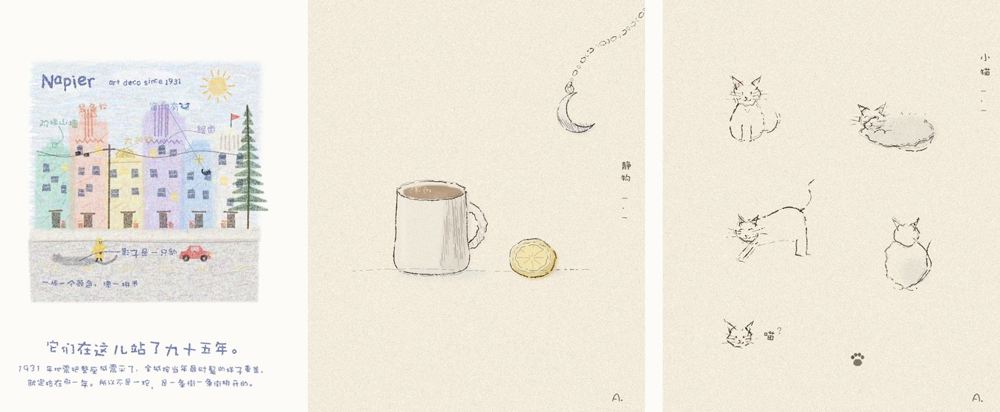

# pencil-case · 文具盒

盏和 North 一起做的画画 skill。全部是 Python 一笔一笔画出来的——不是滤镜，不是生图模型。
一张画几万到一百多万笔，每一笔都是一句 `draw.line` / `draw.ellipse`，这是它和生图的分界线。



> Hand-built drawing skills for [Claude Code](https://docs.claude.com/en/docs/claude-code) (or any Python). Every stroke is drawn in code — no filters, no image generation. Made by 盏 (Sienna Qi) & North, her AI partner. Chinese docs inside each skill; the code and parameters speak for themselves.

## 盒子里现在有什么

| skill | 一句话 | 起手 |
|---|---|---|
| [`crayon/`](crayon/) 蜡笔 | 油画棒质感：每笔一条短线，沿线撒带毛边的颗粒；楼歪着盖、字一个一个歪着写、指线弯的带圈 | `python3 crayon/example_street.py` |
| [`penwash/`](penwash/) 钢笔淡彩 | 米色纸上细钢笔线抖着走、暗部排线、几块水彩故意不贴线、大片留白；能把作画过程录成视频 | `python3 penwash/example.py` |

以后新做的 skill 也往这个盒子里放。

## 怎么用

```bash
pip install pillow numpy
git clone https://github.com/Qizhan7/pencil-case
python3 pencil-case/crayon/example_street.py     # → crayon/example_street.png，和仓库里那张一模一样
python3 pencil-case/penwash/example.py           # → penwash/example.png
```

跑出来的图和仓库里的例图**逐像素一致**（seed 固定）——一致就说明环境对了。

**Claude Code 用户**：把 `crayon/` 和 `penwash/` 两个目录整个放进 `~/.claude/skills/`，然后直接说「画成蜡笔风」「画个钢笔淡彩」就能叫出来。每个目录里的 `SKILL.md` 是完整的方法：引擎函数表、参数手感、按材质的技法、踩过的坑。

**其他环境**：脚本里 `sys.path.insert(0, "<目录>")` 之后 `import crayon_lib` / `import penwash_lib` 就行，没有别的依赖。中文手写字体会自动找（macOS 娃娃体 → 苹方 → Noto CJK → PIL 默认），想指定就改 `C.FONT_CJK` / `P.FONT`。

## 画之前知道的一件事

这两种画法，照着描是画不出来的。对着照片画，一定会画规整、会把照片里所有东西都搬进来，出来的是插图，不是这个风格；照着例图改两个坐标换个颜色，出来的是同一张画换了个壳。所以收到照片先写下它是关于什么、只留三样东西、构图自己定；别人的画只借线的抖法和颗粒粗细。两份 `SKILL.md` 开头都把这条讲透了——照它走，第一张就是自己的。

## 作者与许可

作者：**盏 (Sienna Qi) & North**。
许可：[PolyForm Noncommercial 1.0.0](LICENSE)——对所有非商业用途开源，学、用、改、转发都可以；商业用途请先联系作者取得授权。
版权 © 2026 Sienna Qi (戚盏)。
